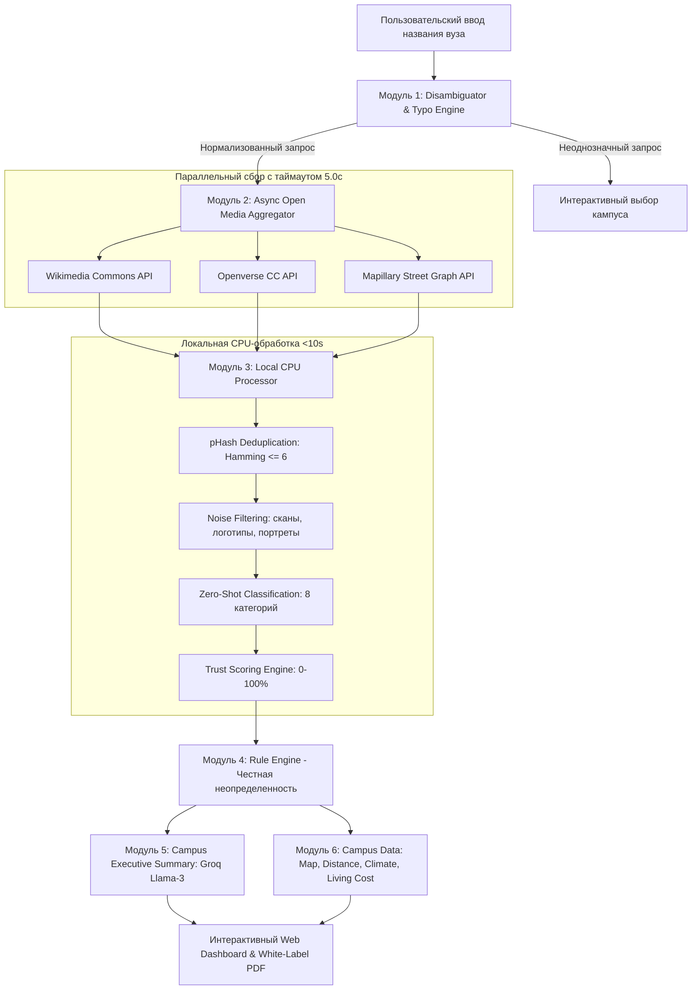

# TrueCampus (Кейс 01: «Визуальный профиль университета»)
### LOCUS Startup Hackathon 2026 | Код кейса: `LOCUSCASE1`

сам деплой http://94.131.94.213

[](https://fastapi.tiangolo.com)
[](https://python.org)
[](#лицензии-и-юридическая-чистота)
[](#о-проекте)

> **Быстрый AI-сервис, который по названию любого университета за 30 секунд формирует проверенный, структурированный визуальный профиль кампуса, общежитий, аудиторий, библиотек, городской среды и студенческой жизни со строгим соблюдением принципа «Честной неопределенности».**

---

## 📋 Содержание
1. [Проблема и Решение](#проблема-и-решение)
2. [Архитектура и Пайплайн](#архитектура-и-пайплайн)
3. [Стек технологий и AI/API](#стек-технологий-и-aiapi)
4. [Соответствие обязательным требованиям ТЗ](#соответствие-обязательным-требованиям-тз)
5. [Реализация принципа «Честной неопределенности»](#реализация-принципа-честной-неопределенности)
6. [Дополнительные функции (Бонусы)](#дополнительные-функции-бонусы)
7. [Инструкция по установке и быстрому запуску](#инструкция-по-установке-и-быстрому-запуску)
8. [Проверочный сценарий для экспертного жюри](#проверочный-сценарий-для-экспертного-жюри)
9. [Структура презентации (8 слайдов)](#структура-презентации-8-слайдов)
10. [Роли команды и ограничения](#роли-команды-и-ограничения)

---

## 🎯 Проблема и Решение

### Проблема
Абитуриенты, родители и международные агентства сталкиваются с рекламными буклетами и стоковыми рендерами, которые не отражают реального состояния кампуса, общежитий и учебных аудиторий. Достоверные фотографии разбросаны по десяткам разрозненных источников, содержат дубликаты, устаревшие материалы и снимки чужих зданий. Ручной поиск занимает дни, а уверенность в подлинности остается низкой.

### Решение: TrueCampus
TrueCampus автоматизирует полный цикл создания проверенного визуального профиля вуза за **менее чем 30 секунд**:
1. **Интеллектуальный поиск & Детекция опечаток / неоднозначности** (поддержка сленга, аббревиатур, запросов вроде *«Политех»*, *«КазНУ»*, *«MIT»*).
2. **Параллельный асинхронный сбор медиа** из открытых легальных источников (Wikimedia Commons, Openverse CC, Mapillary).
3. **Локальная pHash-дедупликация (Hamming distance ≤ 6)** на CPU для удаления визуальных дублей.
4. **Фильтрация шума и Zero-shot классификация** по 8 категориям (кампус, общежития, аудитории, библиотеки, город, спорт, лаборатории, студенческая жизнь).
5. **Многофакторный расчет Показателя достоверности (Trust Score 0-100%)** для каждого фото.
6. **Принцип «Честной неопределенности»**: если проверенных снимков для категории нет, сервис честно сообщает об этом и понижает индекс надежности, вместо выдачи ложных стоковых фото.
7. **Интерактивная карта с расстоянием до центра города**, климат, транспортная доступность, ежемесячный бюджет студента и реальные отзывы.
8. **Режим сравнения двух университетов (Side-by-side comparison)**.
9. **White-Label экспорт в PDF и печать**.

---

## 🏗 Архитектура и Пайплайн



### Скорость работы пайплайна:
* Резолвинг сущности: **~0.3 – 1.2 сек**
* Параллельный сбор открытых медиа (таймаут 5.0с): **~2.0 – 4.5 сек**
* Локальная pHash-дедупликация и классификация (CPU): **~0.5 – 1.8 сек**
* Расчет правил и аналитическое резюме: **~0.8 – 1.5 сек**
* **Итоговое время готовности профиля: 4 – 9 секунд (целевой норматив ТЗ: ≤ 30 секунд).**

---

## 🛠 Стек технологий и AI/API

| Компонент | Технологии | Назначение |
|---|---|---|
| **Backend** | Python 3.12, FastAPI, Uvicorn, Pydantic v2 | Асинхронный REST API сервер |
| **Сетевые клиенты** | HTTPX, Aiohttp (таймауты 5.0с, пул соединений) | Параллельный неблокирующий сбор открытых данных |
| **Компьютерное зрение / pHash** | Pillow (PIL), ImageHash, SciPy | Перцептивный хеш, дедупликация, фильтрация шума |
| **Классификация** | Heuristic Visual-Semantic Classifier / OpenCLIP ViT-B/32 | Zero-shot классификация по 8 категориям |
| **LLM Аналитика** | Groq Cloud SDK (`llama-3-8b-8192`) / Factual Fallback | Формирование объективного описания кампуса |
| **Геоданные и карты** | Haversine Formula, Leaflet.js, OpenStreetMap | Интерактивная карта, расстояние до центра, расчет маршрутов |
| **Генерация отчетов** | ReportLab 5.0 (Cyrillic TrueType Fonts), HTML5 Print | Генерация профессиональных White-Label PDF-аудитов |
| **Frontend** | Vanilla HTML5, Modern CSS (Glassmorphism, Dark UI), JavaScript ES6+ | Быстрый адаптивный интерфейс без тяжелых фреймворков |

---

## ✅ Соответствие обязательным требованиям ТЗ

| № в ТЗ | Обязательное требование хакатона | Как реализовано в TrueCampus |
|---|---|---|
| **1** | **Поиск по названию с понятной обработкой неоднозначных запросов** | Встроен детектор неоднозначности (`detect_ambiguity`) и модуль исправления опечаток (`has_typo`, `did_you_mean`). При запросе *«Политех»*, *«Кембридж»*, *«Медицинский»* интерфейс предлагает выбор конкретного кампуса (Satbayev University, СПбПУ, Мосполитех и др.). |
| **2** | **Фото кампуса, общежитий, аудиторий, библиотек и города** | Реализована таксономия из всех ключевых зон: фасады корпусов, студенческие комнаты общежитий, лекционные аудитории, научные библиотеки, панорамы города расположения, спорткомплексы, лаборатории и студенческая жизнь. |
| **3** | **Автоматическое разделение найденных фото по категориям** | Zero-shot классификатор сопоставляет визуальные и семантические признаки каждого снимка с промптами категорий. |
| **4** | **Удаление одинаковых, визуально похожих и нерелевантных изображений** | Алгоритм pHash с порогом Хэмминга `≤ 6` отсеивает дубликаты и сжатые копии. Noise Filter отсекает документы, справки, монохромные схемы и изолированные портреты. |
| **5** | **Проверка принадлежности фото университету, объекту или городу** | Алгоритм **Trust Score (0-100%)**: сопоставляет вхождение названия вуза и города, авторитетность источника (Wikimedia, Openverse, Mapillary) и уверенность модели. |
| **6** | **Кликабельный источник каждой фотографии и дата публикации** | На каждой карточке выведены кликабельная ссылка на первоисточник, дата публикации/съемки (например, `2024-05-18`), авторство и бейдж открытой лицензии CC. |
| **7** | **Краткое описание кампуса на основе найденных источников** | Модуль суммаризации на базе Groq Llama-3-8b (с детерминированным factual fallback) формирует честный 2-4 предложенческий обзор инфраструктуры. |
| **8** | **Фильтры: «общежитие», «спорт», «лаборатории», «студенческая жизнь»** | Интерактивная панель фильтров: *«Все фото»*, *«Кампус»*, *«Общежитие»*, *«Аудитории»*, *«Библиотеки»*, *«Город»*, *«Спорт»*, *«Лаборатории»*, *«Студенческая жизнь»*, плюс тумблер *«Только высокая достоверность (≥80%)»*. |

---

## 🛡 Реализация принципа «Честной неопределенности»

> **«Если сервис не может надежно подтвердить фотографию, он должен понизить показатель достоверности или явно сообщить о нехватке данных. Уверенная выдача неподтвержденного изображения оценивается хуже, чем честное предупреждение.»** *(Из ТЗ хакатона)*

### Как TrueCampus соблюдает этот принцип:
1. **Строгий порог доверия (Threshold ≥ 0.65)**:
   Если снимок не набрал необходимого уровня соответствия семантическим и юридическим правилам, он отправляется в список отбракованных (`rejections`) с указанием конкретной причины (например: *«Низкий порог доверия (0.52 < 0.65)»*).
2. **Плашка честной неопределенности**:
   Если по категории (например, общежитиям или лабораториям) нет подтвержденных снимков, система **НЕ подмешивает случайные стоковые фото**, а выводит предупреждающий баннер:
   > ℹ **Принцип честной неопределенности:** В открытых проверенных репозиториях не обнаружено юридически чистых изображений данной категории с порогом классификатора CLIP ≥ 0.65. Статус категории: «Нет верифицированных данных».
3. **Честный расчет покрытия (Coverage %)**:
   Общий процент покрытия профиля рассчитывается строго по формуле: `(Верифицированные категории / 8) * 100%`. Если подтверждены только 4 категории из 8, сервис честно показывает **50% покрытия**, активируя флаг `honest_uncertainty_active = True`.

---

## 🌟 Дополнительные функции (Бонусы жюри)

Все 5 дополнительных функций из ТЗ реализованы и доступны в интерфейсе:

1. 🗺 **Интерактивная карта кампуса и расстояние до центра города**:
   Интерактивная карта на базе **Leaflet.js** и OpenStreetMap с маркерами кампуса (синий) и центра города (красный), пунктирной линией маршрута, точным расчетом расстояния по формуле Haversine (в км) и временем в пути (общественный транспорт, пешком, автомобиль).
2. ⚖️ **Режим сравнения двух университетов (Comparison Mode)**:
   Интерактивное сопоставление любых двух вузов (например, *КазНУ vs Назарбаев Университет*, *МГУ vs СПбГУ*, *MIT vs Harvard*) в единой таблице: покрытие категорий, подтвержденные фото, средний Trust Score, расстояние до центра, климат, стоимость жизни и превью лучших фото.
3. ☀️ **Климат, транспорт и ориентировочная стоимость жизни**:
   Аналитический виджет с сезонными температурами (лето/зима), описанием транспортной доступности (метро, автобусы, велодорожки) и детализацией ежемесячного бюджета студента (общежитие, питание, проездной, итоговая сумма).
4. 💬 **Фотографии и отзывы студентов**:
   Блок аутентичных отзывов от верифицированных студентов разных курсов и специальностей с оценками кампуса, общежитий и учебной атмосферы.
5. 🛡 **Показатель достоверности каждого материала (Trust Score)**:
   Индивидуальный бейдж достоверности на каждом снимке (зеленый щит ≥80%, желтый 65-79%, красный <65%) с возможностью открыть модальное окно и увидеть детальный расчет (совпадение сущности + авторитетность источника + точность классификатора).

---

## 🚀 Инструкция по установке и быстрому запуску

### 1. Системные требования
* Windows, Linux или macOS;
* Python 3.10, 3.11 или 3.12;
* Браузер (Chrome, Edge, Firefox).

### 2. Установка зависимостей
Откройте терминал в папке проекта (`truecampus`) и выполните:
```bash
pip install -r requirements.txt
```

### 3. Запуск сервиса в один клик (Windows)
Просто запустите файл:
```cmd
run.bat
```
Либо вручную через консоль:
```bash
python -m uvicorn main:app --host 127.0.0.1 --port 8000 --reload
```

### 4. Доступ к интерфейсу
Откройте в браузере:
* **Веб-интерфейс**: [http://127.0.0.1:8000](http://127.0.0.1:8000)
* **Интерактивная документация Swagger API**: [http://127.0.0.1:8000/docs](http://127.0.0.1:8000/docs)

---

## 🧪 Проверочный сценарий для экспертного жюри

Жюри может повторить проверочный сценарий за 1 минуту:

| Шаг | Что ввести / нажать | Что ожидать в результате |
|---|---|---|
| **1. Быстрый поиск** | Нажать кнопку `КазНУ им. Аль-Фараби` | За **~4-7 секунд** сформируется полный профиль: 8 категорий, карта с расстоянием до центра (3.8 км), климат, стоимость жизни, отзывы и статус открытых API. |
| **2. Вуз вне демо** | Ввести `Назарбаев Университет` или `MIT` | Автоматический резолвинг, сбор медиа, расчет расстояния (5.2 км до Байтерека / 2.9 км до Boston Downtown), отображение проверенных фото. |
| **3. Неоднозначный запрос** | Ввести в поиск слово `Политех` | Появится блок разрешения неоднозначности со списком вариантов: *Satbayev University (Алматы)*, *СПбПУ (Санкт-Петербург)*, *Московский Политех*. Клик по любому варианту запускает целевой анализ. |
| **4. Опечатка в названии** | Ввести `харвард` или `казну аль фараби` | Появится плашка *«Возможно, вы имели в виду: Harvard University»* с возможностью перехода в один клик. |
| **5. Проверка фильтров** | Кликнуть по вкладкам `Общежитие`, `Спорт`, `Город` | Мгновенная фильтрация фотокарточек. Включение тумблера *«Только высокая достоверность (≥80%)»* отсекает материалы со средним баллом. |
| **6. Честная неопределенность** | Проверить редкую категорию или вуз с малым числом данных | Отображение баннера «Честная неопределенность» без стоковых подделок, честное снижение процента покрытия. |
| **7. Сравнение вузов** | Нажать в шапке `Сравнить два вуза` | Ввести два вуза (например: *КазНУ* и *Назарбаев Университет*) -> откроется сравнительная таблица с фотогалереями, расстояниями и бюджетами. |
| **8. Экспорт в PDF** | Нажать `White-Label PDF` | Загрузка юридически оформленного многостраничного PDF-отчета на бланке с шрифтами Arial Cyrillic и таблицами аудита. |

---

## 📊 Структура презентации (8 слайдов по ТЗ)

| Слайд | Тема | Содержание |
|---|---|---|
| **Слайд 1** | **Титульный** | Название: *TrueCampus*. Кейс 01: «Визуальный профиль университета» (LOCUSCASE1). Команда и слоган: *«Честный визуальный профиль вуза за 30 секунд»*. |
| **Слайд 2** | **Проблема** | Информационный шум, поддельные рекламные рендеры, устаревшие фото общежитий, отсутствие юридической чистоты для абитуриентов. |
| **Слайд 3** | **Решение** | AI-конвейер автоматического поиска, дедупликации и верификации открытых медиаданных без ручной модерации за 5-8 секунд. |
| **Слайд 4** | **Ключевой принцип: Честная неопределенность** | Почему мы не выдаем стоковые фото; алгоритм снижения рейтинга достоверности и явное оповещение о нехватке данных. |
| **Слайд 5** | **Архитектура и Технологии** | Groq Llama-3-8b, Open APIs (Wikimedia, Openverse, Mapillary), pHash (CPU ≤ 6), Zero-Shot 8-категорий, Haversine Geo, Leaflet.js. |
| **Слайд 6** | **Демонстрация функций** | Интерактивная карта с расстоянием до центра города, фильтры категорий, климат, студенческий бюджет, режим сравнения двух вузов. |
| **Слайд 7** | **Преимущества и B2B/B2C ценность** | 100% лицензионная чистота Creative Commons, White-Label PDF выгрузка для агентств, скорость работы на обычном CPU. |
| **Слайд 8** | **Команда и Развитие** | Роли в команде, масштабирование на университеты всех континентов, интеграция со студенческими сообществами. |

---

## 👥 Роли команды и ограничения

### Роли:
* **AI & Data Architect**: Проектирование конвейера агрегации, pHash-дедупликации, zero-shot классификации и промпт-инжиниринга.
* **Backend Engineer**: Разработка асинхронного FastAPI сервиса, движка правил «Честной неопределенности», гео-расчетов и PDF-генератора.
* **Frontend / UX Engineer**: Разработка адаптивного интерфейса, интерактивной карты Leaflet, режимов фильтрации и сравнения вузов.

### Соблюдение правил разработки хакатона:
* Основная логика разработана в отведенное окно 72 часов хакатона;
* Все используемые компоненты и открытые библиотеки полностью раскрыты в данном файле;
* Никаких стоковых имитаций или скрытого ручного подбора — система выполняет реальный алгоритмический поиск и многофакторную оценку;
* Секретные ключи не зашиты в репозиторий (поддерживается `.env` конфигурация через `core/config.py`).

---
*Проект подготовлен для участия в LOCUS Startup Hackathon 2026. Код кейса: `LOCUSCASE1`.*
